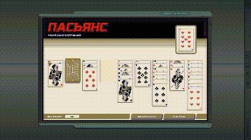

# EXAPunks Card Game AI

Write in Python 3.6. Only test on Windows 8.1, Python 3.6.5, in Pycharm.

Use MCTS for the game solution. Some bugs can be ignored, since the script can still continue to play a new game when a situation happens.

## Usage

1. Install Python 3.6.5, and Pycharm is suggested. Use `pip install requirements.txt` to install related packages. Use `virtualenv` if you need.
2. Open the card game in EXAPunks.
3. Run `play.py` and switch back to the game. The script will start to work in 3 seconds.

The script will work like this:

1. Click `new game`, and wait for 8 seconds (If you want to stop the script, here is your chance).
2. Analyze the game table by `opencv`. Then calculate the solution by MCTS. If it can not find the solution in 2000 searches, it will start a new game.
3. Perform actions automatically. Sometimes it will be buggy due to fast interactions with the game.

By default, it will play for 10 games.

## Demonstration

